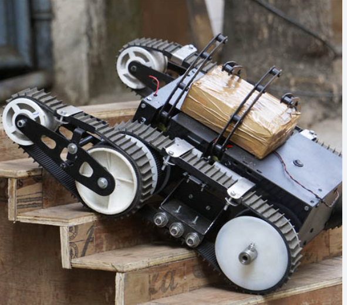

 

## **About**
Designed a robotic vehicle to climb two flights of stairs to retrieve an egg. We were given a 500 dollar budget to create a remote control vehicle. Students had access to the 3d printer to manufacture parts. We manufactured mounts for the motor and miscellaneous parts.  My team and I split the tasks into two subsystems, hardware, software. The process that we went through was researching the components and calculating the data that we needed for components. After that we wrote reports to keep track and organize our work. Once we received the ordered parts we assembled and tested our vehicle.

## **Contribution**
I was the software lead on the team. I handled the electronic design and software part of the vehicle. I used an Arduino to control the electronic components, along with the motor controllers. At first I did not know what I was doing since I was unfamiliar with the Arduino and wiring the components together. However once I did my research it was less complicated. It was not as easy since I fried my usb port on my laptop due to accidentally unplugging the ground wire. I also contributed to other subsystems by helping design CAD and 3d printing parts for the vehicle. 

## **Outcome**
I got to learn how to 3d print and CAD during the class. It was a really fun experience and made me want to get into 3d printing as a hobby. The class really showed me how far 3d printing has come and its future possibilities. It was also my first time playing with an Arduino and it was the reason why I changed from mechanical engineering to computer engineering. I really enjoyed the programming part of the project even though CAD and 3d printing were cool. I just could imagine myself coding as a career.

