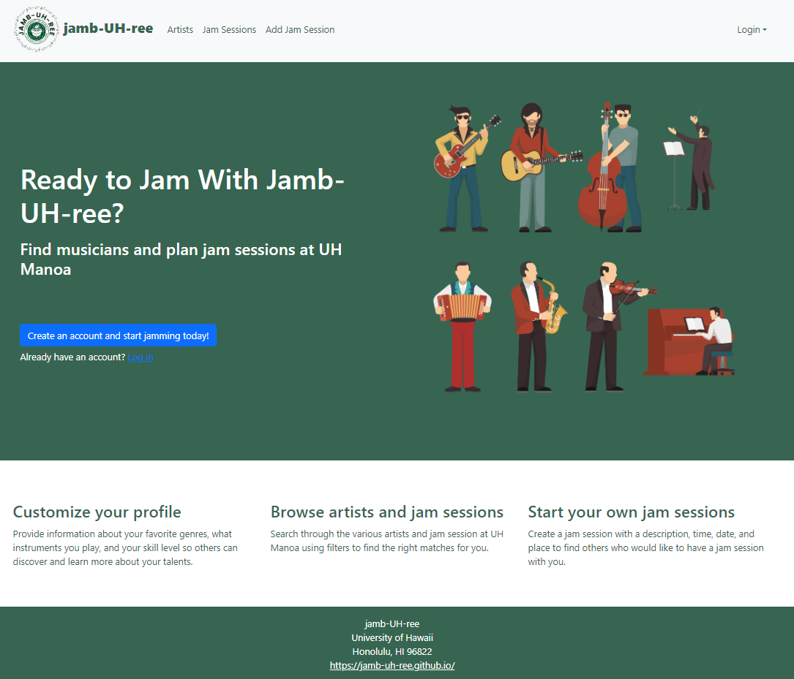
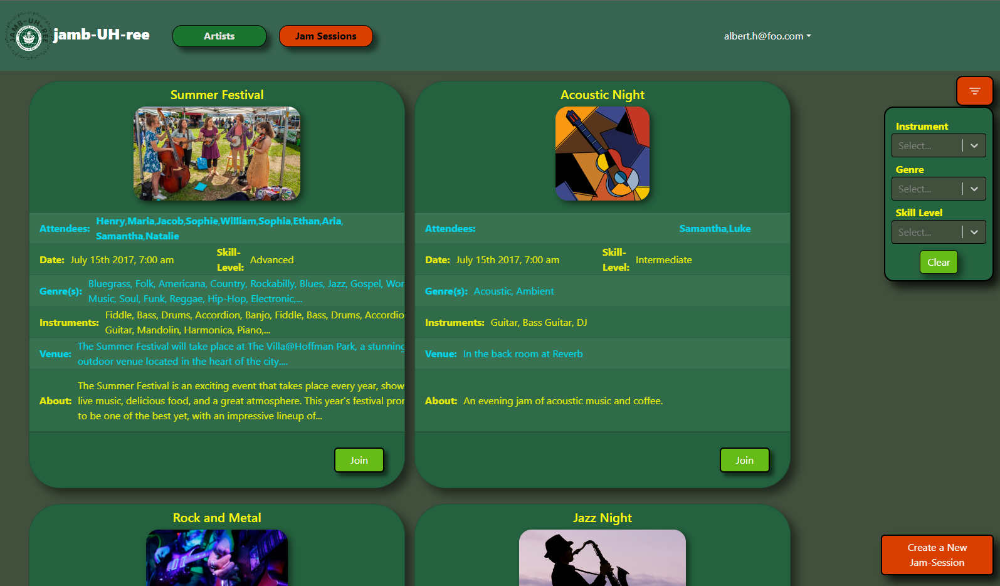

 

## **About**
A website application where people can come together and jam out together. User can make an account and fill their information with their musical abilities. Once an account is made a user can look at existing created jam sessions from other users. The jam session display information for users to join. The user can see the time, date,location and skill level of the session. If a user is interested they can press the join button to join the jam session or press it again to unjoin. Users can also look at other artist and see their profiles and get in contact with them.

  

## **Contribution**
I was on a team of 4. I created the front end development pages of create jam session, edit profile and create jam session. I used a Bootsrap-React to create the front end. Example I used the Button, Forms and Cards. For the backend I set the redirects for each button made. An example is when you click the submit button in "create jam session", it will redirect to the jam session page. 

## **Outcome**
I got to learn how to develop a web page using Meteor, React, Bootstap, and MongoDB. We made a good looking web application in my opinion and it is probably the best out of the class. This was my first time doing something like this. It was a good learning experience. It made me rethink about my career path about software engineering. Even though it was a good learning experience, I dont know if web devleopment is something I want to do now. It was a cool experience because i got to be involved in front end, back end. 
