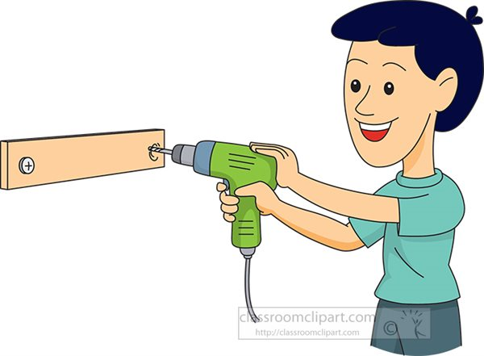

  

   
  
# ***Drilling Down the Design Pattern***
Design patterns are reusable “templates” that can be applied to solve common problems. Design patterns are like a drill and the fasteners, that can represent the different software engineer problems. The drill attachments represent the software engineer’s solution which is tailored to the problem. Design pattern allows for quicker implementation time because the engineer would not have to write the repetitive code. This will allow them to focus more on the main functions.

# ***Jamb_UH-Ree Pattern***
Design pattern that my team and I have used is the base template. We used the Bowfolios template that was available to us. We chose the Bowfolios because it had a similar structure to that of our program, Jamb-UH-ree. The main component from Bowfolios was the structure card and features like the note stime stamp and joining. We filled the structure with our data and changed the template. From this point, we were able to implement other key features. This method saved us a lot of time and saved us from starting from scratch. Without this template our team would have taken the majority of our project time on just set up. 
