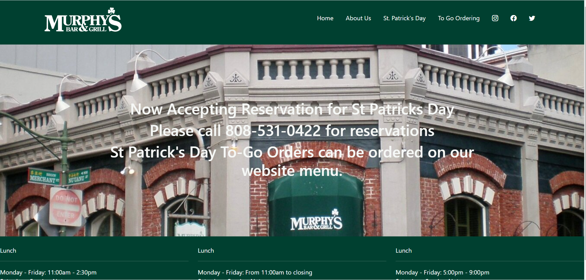
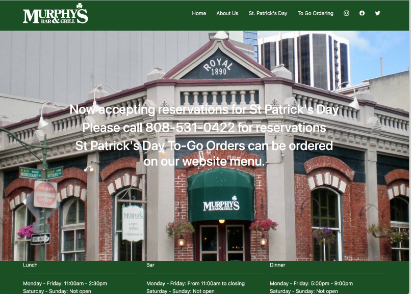

# ***Intro***
Raw CSS and HTML are horrendous by themselves, but Bootstrap makes it that less. Bootstrap 5 makes front-end development easier than just using CSS and HTML. UI framework has all these predefined classes and interfaces that set the behavior of the window-based UI subsystem. The predefined classes give the user shortcuts allowing them to develop the front end more quickly. 

  

# ***Personal Experience***
Learning Bootstrap was really confusing and overwhelming. The div, container, and col layout was difficult for me to understand. Till now I’m still learning and understanding why things do what it does. I need to watch the FreeCodeAcademy Bootstrap video again because there were many things, I was learning on the fly with all the exercises that happened during class and outside. There are many unused commands that I did not use, that could have been helpful during my exercises. During one assignment I did not know how to properly position my text. I kept using the padding and margin to help me position it, but it did not position it to how I wanted it to be. Later I found out that you could use the class align-item-center to do so.  It was awesome to recreate a website and see it slowly render the look closely as the original. I couldn’t imagine trying to do this with just HTML and CSS. The above photos are some of the websites I was able to recreate. These two-assignment compared to others, really allowed me to understand bootstrap and its framework. These assignments took me the longest time to do but they allowed me to learn a lot from my mistakes and how I can improve for the better. I got to experiment with the classes and the interface and see what happens if I enter this class here or what happens if I got rid of this class here. It is overwhelming to see all the classes in one div and try to understand what it does.  Continuously practicing will eventually lead me to understand.
# ***Conclusion***
The framework from Bootstrap gives the advantage over just raw CSS and HTML.  Allowing for resizing with pixels makes it prettier for every screen size. Creating a navbar using bootstrap is more convenient than CSS and HTML. Positioning is hard in CSS because you manually must do it and adjust but Bootstrap’s, classes make it easier and less of a headache.  Ui frameworks are an important concept to have as a software engineer because it does things in a better way that you can’t replicate with CSS and HTML as easily. Bootstrap is a big investment in time to learn but in the end, it helps create better UI design.
  
