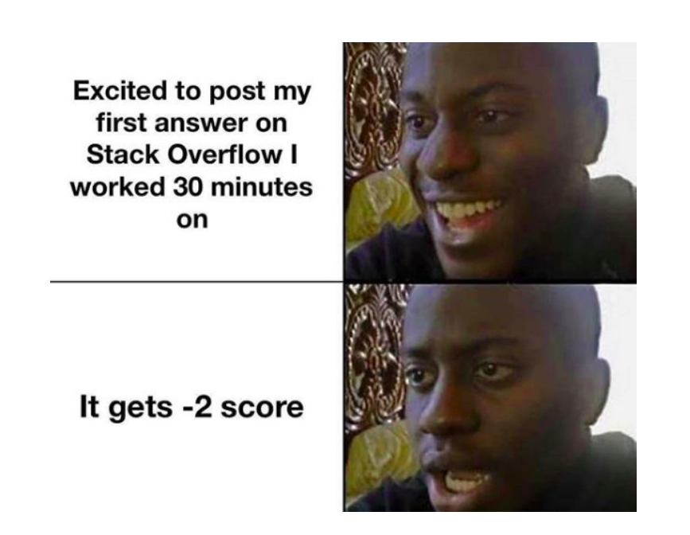

## **The Why**
If you never asked for help with your code, then you are a LIAR! Even the most experienced engineers still run into problems. Asking for help is common as a software engineer. To make sure that we do not waste other people’s time and for us to get efficient answers, we must ask smart questions. A smart question is a well formatted question that gives the reader some necessary context and gets straight to the point. Sometimes as software engineers, and maybe as individuals trying to accomplish a task run into unknown or unfamiliar areas. A lot of, “I’m not sure’s” come to mind but aren’t sure what questions need to be asked? This might intimidate or discourage us to ask questions. In order to help with that, we should analyze and review our accomplished work so far and see where the holes are. Gather as much information or necessary context and then relay it to the helping party, that way unnecessary time isn’t consumed.
## **The Good**
In [Stack Overflow](https://stackoverflow.com/questions/72562941/visual-studio-2022-find-all-in-entire-solution-is-not-working-properly), the question that was chosen is what I would categorize as a smart question. The developer posted a question about having trouble using the “Find All” Function in the 2022 Visual Studio. He or she gives extra information that they know the key is in the file, but the function doesn’t find it. He states that he can find it another way by searching in the current document. The developer also does not blame the problem on anybody and ask If the mistake was on his part with configuration step installation after clean installation. With the given smart question, the responses were helpful, and no other developers could criticize the author of the question. The answers were also clear and concise since the author specified his problem.
## **The Bad**
Now here is a candidate to be criticized by fellow developers. In this [Stack Overflow](https://stackoverflow.com/questions/75254260/how-to-end-an-if-statement), the bad question I chose was a user asking how to end an if statement. They did not know if this statement should end with “if-else”, “if”. Their first option could have been to STFW. Just by gathering more information they could have asked a better question. The user could have shown an example of applying the statement to clarify his question. The user should’ve first researched and then explained how they think, an if-else statement works. Another suggestion is fixing the structure of his or her question to give more formality. For example, he capitalizes “u” in “use”, in the middle of a sentence. Another example is that they said thank you and then stated their question again. “how they want to know the rules of an ‘if’ statement”. With adding more context and formatting their question, they would be able to obtain a clearer and helpful answer.

